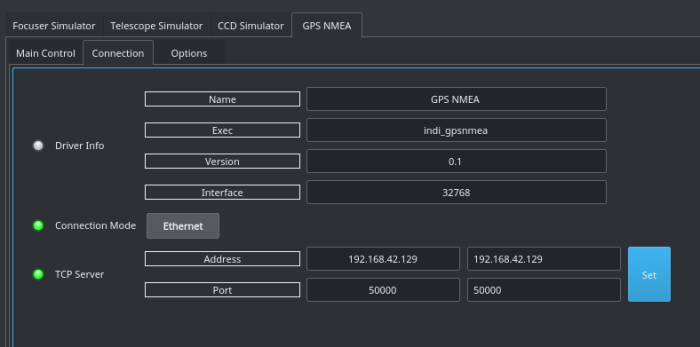
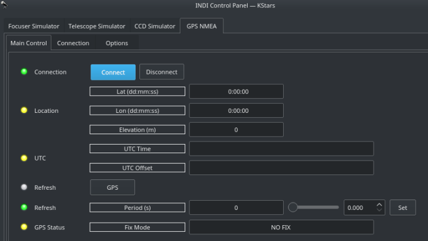
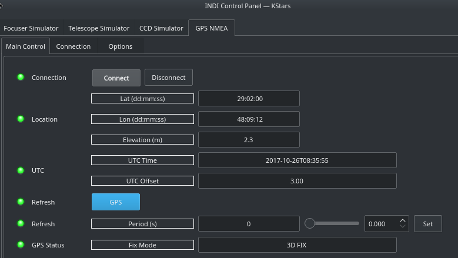

# GPS NMEA

## Features

INDI GPS NMEA driver is designed to parse GPS  [NMEA](http://gpsworld.com/what-exactly-is-gps-nmea-data/)  streams to provide location and time updates. Usually, the driver is running on a device like Raspberry PI while the GPS NMEA server is running on a remote device like a phone that resides on the same network on the Rasbperry PI. The driver can be configured to monitor GPS data streams from the phone and then synchronize INDI drivers and clients accordingly. This is especially handy when you the RPi3 is used for mobile observatories on the go.

Any App that provides NMEA streams as a server are supported. For Android,  [ShareGPS](https://play.google.com/store/apps/details?id=com.jillybunch.shareGPS&hl=en)  has been successfully tested with the driver. For iOS,  [GPS 2 IP](https://itunes.apple.com/us/app/gps-2-ip/id408625926?mt=8)  provides the same functionality.

The driver can also change the system time. But since operation requires administrative privileges, you need to set CAP_SYS_TIME capabilities first by running this command:

sudo setcap cap_sys_time=ep /bin/date

There is no need to run the above command on StellarMate.

## Operation

## Connection

Before you connect, you must set the IP address of the GPS NMEA server. If you're using a phone to stream GPS data, find out the IP address of the phone and enter it in the Address field. Furthermore, enter the port used by your App to stream the data. The device where the driver is is running (StellarMate, RPI3..etc) must be on the same network as the phone you are trying to stream from. After you set the TCP information, go to Options and click Save under Configuration. Please note that phone IP addresses are usually subject to change so on your next connection you must reset the address field to whatever IP address currently used by your phone. After all data is set, and assuming your App is already running on your phone, click Connect to establish connection.

## Main Control

When you first connect, a GPS fix is taken and it might take a while before the driver is synchronized to the GPS stream. If the driver remains in NO FIX busy mode for more than 30 seconds, click the  _GPS Refresh_  button to force a refresh.

After a GPS fix is captured, the driver shall update the Location & Time properties. Depending on your client, you may need to configure your drivers and clients to synchronize with the GPS data. For KStars/Ekos, no additional action is necessary. After the fix is taken and Location/Time updated, the driver is no longer deemed necessary and can be disconnected for the current session.

Optionally, you can set the driver to periodically update the GPS data to the clients. This is usually not necessary, but it can be enabled by changing the  _Refresh Period_  property to the desired period in seconds. To disable the periodic refresh, set the period to zero.

### What's difference between INDI GPSD and INDI GPS NMEA drivers?

INDI GPS NMEA driver fills the gap for people who use mobile phone's gps for setting location and time in KStars/Ekos. indi-gpsd does pretty much the same, however it is based on different approach. Both of the drivers set time and location (over INDI server) to other INDI drivers (e.g. mount) and clients (e.g. KStars), but:  
  
**indi-gpsnmea**:

-   reads gps data stream from mobile phone's gps
-   requires network connection of the source of gps data stream i.e. phone running app, which enables gps sharing
-   it is operating system independent

## **indi-gpsd**:

-   reads gps data stream from gpsd service
-   requires gpsd service is running and properly configured as a systemwide service
-   ntpd service can read from gpsd service to synchronize operating system time/date to gps source
-   it is operating system dependent and can be used only on linux