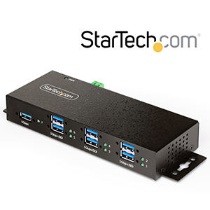
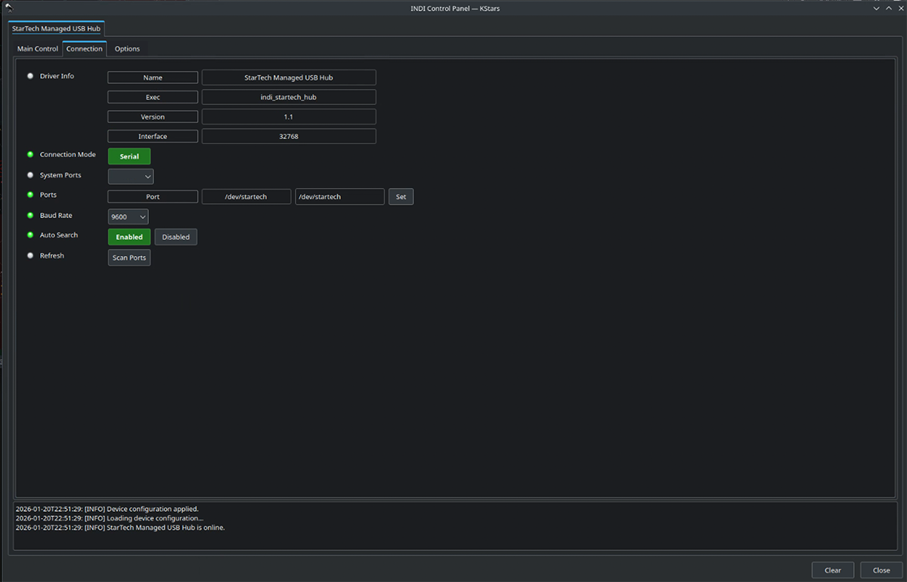
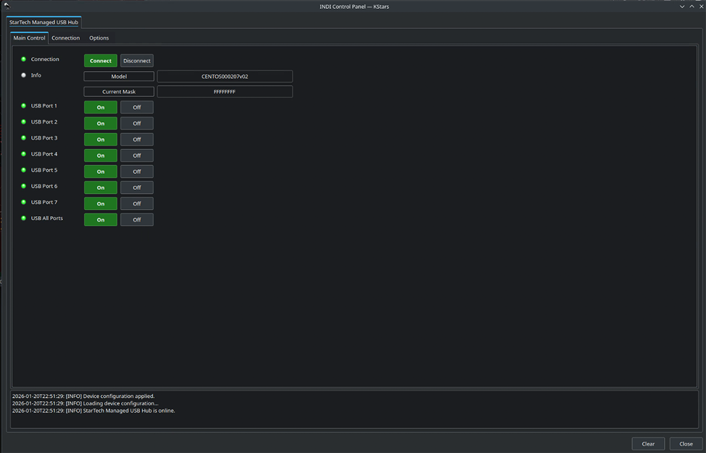
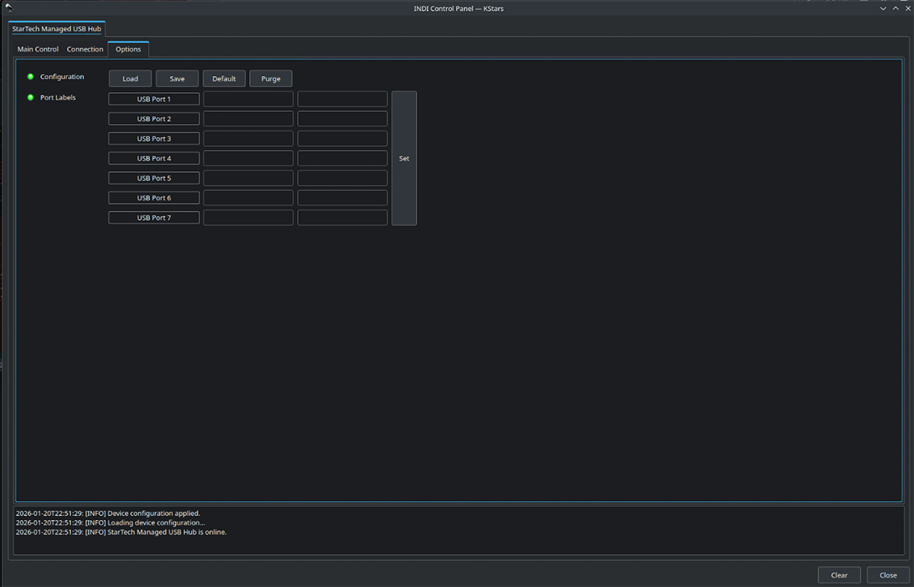

## Features

The driver provides per‑port power and data control for StarTech 7-port Managed USB Hub (Product ID: 5G7AINDRM-USB-A-HUB).
This INDI driver exposes:

- **7 independent power/data ports** (USB Port 1 … USB Port 7)
- A convenience control to switch **all ports** ON/OFF
- Basic device info reporting (model string + current port mask)
- Optional per‑port **labels (aliases)** configured in the Options tab

## Installation

This driver is part of the INDI core build system and installs with the standard INDI build.

### Dependencies

INDI core libraries only.

## Usage Guide

### Connecting to the device

1. Connect the hub to your system.
2. In your INDI client open the **Connection** tab and set the serial **Port** (recommended: a stable udev symlink such as `/dev/startech`) and **Baud Rate** (default 9600).
3. Open the **Main Control** tab and Click **Connect**.



**Connection panel**: select the serial port device and baud rate.

### Main Control

The **Main Control** tab contains (in order):

1. **Connect**: connect and disconnect the device.
2. **Info**: hub model and the current port power bitmask.
3. **USB Port 1 … USB Port 7**: per‑port power and data connection control (ON/OFF).
4. **USB All Ports**: switches all ports ON or OFF with a single command.



### Options

The **Options** tab provides standard INDI configuration controls plus **Port Labels**:

- Set a custom label for each port (max **16 characters**).
- Press **Set** to apply labels immediately (the Main Control port names update right away).
- Press **Save** to persist labels to the INDI configuration file.
- Press **Load** to restore saved labels and apply them to the UI.



## Tips and Best Practices

- Use a **stable serial device path** (udev symlink) to avoid surprises when USB topology changes.
- If you power‑cycle devices frequently, consider setting a reasonable **Polling** interval in the Options tab.
- When using Port Labels, press **Save** only once you are happy with them (otherwise they reset on disconnect).

## Troubleshooting

### Device does not connect
- Verify the serial device path in the Connection tab (use `Scan Ports` in the **Connection** tab to scan for available serial ports).
- Check permissions for the serial device (udev rule or membership in `dialout`).

### Port switching works but labels do not update
- Ensure you pressed **Set** in the Port Labels section. Labels should update immediately.
- If labels were loaded from disk, press **Load** and confirm the Main Control port names refresh.

### Still stuck?
Enable verbose logging in INDI server and collect logs:

```bash
indiserver -v indi_startech_hub
```
