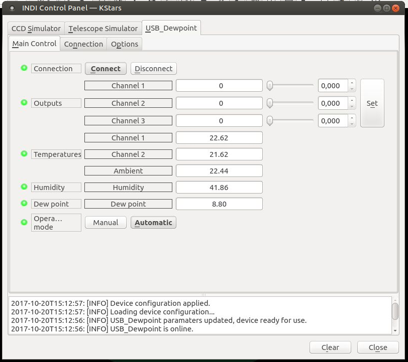
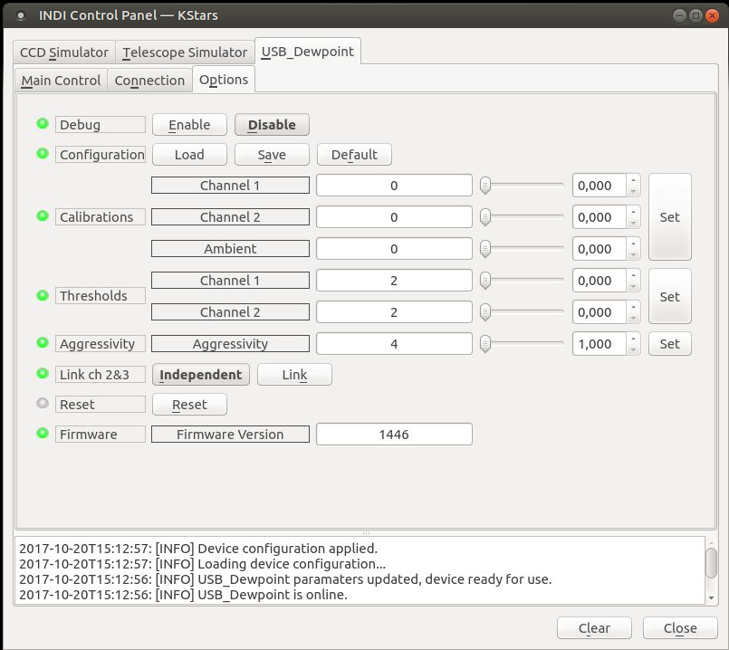
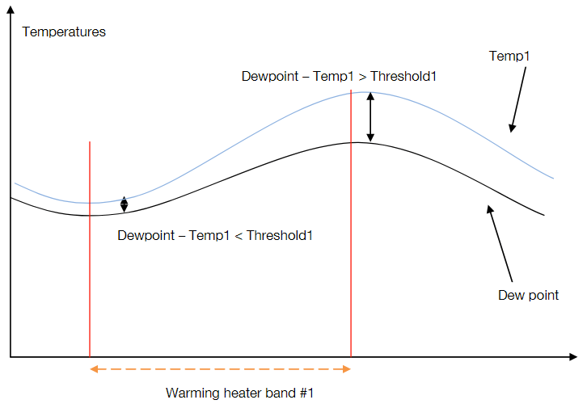

## Features

USB_Dewpoint calculates in real time the Dewpoint, thanks to ambiant humidity probe close to your instrument. It also connects to 2 external temperature probes (attached to tube or mirrors) and compares these temperatures to the Dewpoint. If temperatures too close to dewpoint it heats in a smooth or aggressive maner. We can also call it a heating regulator.

Second, if no heat required, USB_Dewpoint only uses 0.05W to run. It connects to computer USB (or HUB 2.0 / 1.1) to operate remotely and can be operated manually or in autonomy.

## Main controls

Main controls show information about current device state and allow for manual control of the power to the three output channels (0-100%). In automatic operating mode the values are essentially read-only as the device controls them itself based on temperature readings. Temperatures and humidity are read from the device every 10 seconds.

## Options

Values shown here are the device defaults which are restored if "Reset" button is pressed. All settings are automatically written to the device EEPROM so they are retained even if the device is used completely autonomously without computer.

Individual options do:

-   Calibrations (range 0-9) are added to the temperature values in the device and can be used to equalize readings from all the temperature sensors
-   Thresholds (range 0-9) determine when the device starts applying power to the channels
-   Aggressivity (range 1-4) determines how quickly the device starts applying more power
-   Channel 3 is normally manual control only (as there are only two temperature sensors), but can be linked to channel 2 for more power or using two dew heaters
-   Reset button resets all values to device defaults shown here

In automatic mode the device tries to keep channel temperature above dew point plus threshold like shown in this picture from the Windows driver manual (I think the equations are wrong way around, they should be Temp1-Dewpoint, but the idea is clear):  

<h2