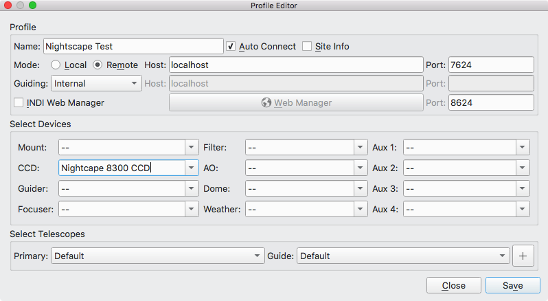
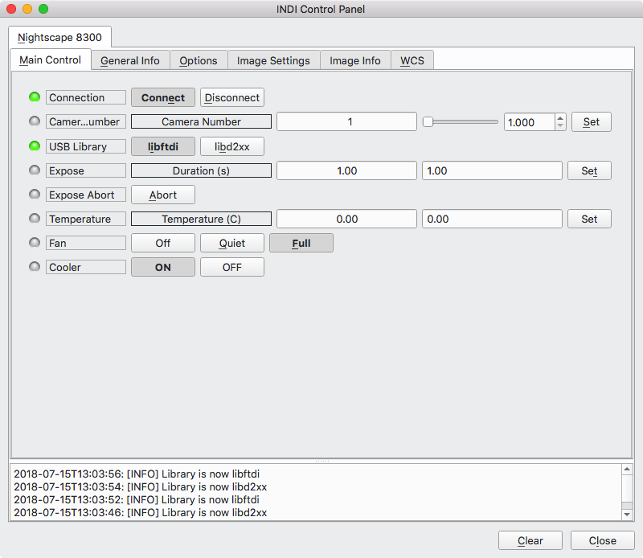
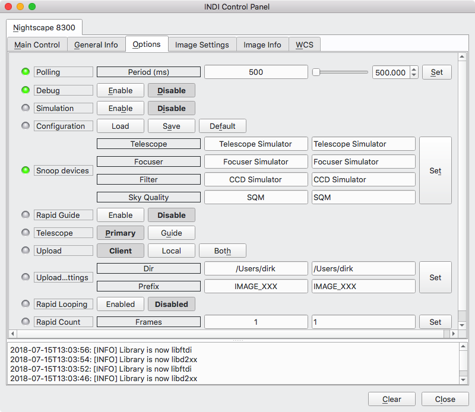
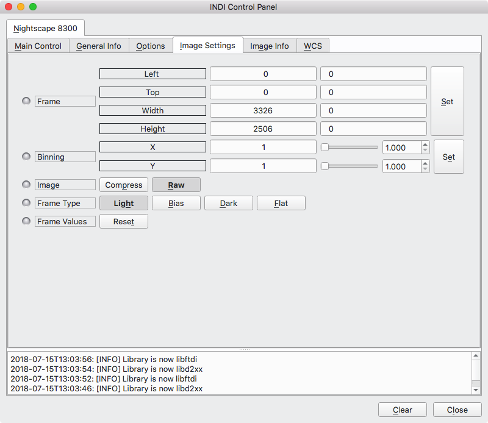
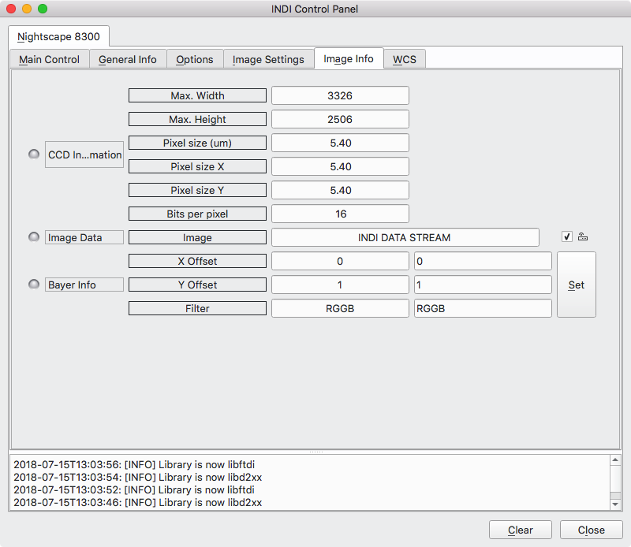

# 

Celestron Nightscape 8300

## Features

The Nightscape driver should support all features of the Alta and Aspen cameras including

-   USB connection
-   Temperature setpoint
-   Hardware binning (vertical only. horizontal binning is implemented in software)
-   Frame sub-selection
-   Shutter capture mode; Dark, Bias, Light (this keeps shutter closed for dark and bias frames).
-   Fan speed
-   Selectable USB Libray (libftdi1 or FTDI D2XX).
-   Selecatbale camera number (for multiple cameras).

## Configuration

In order to use your Nightscape 8300 camera in INDI the first step is to configure the CCD setting in a new profile or editing and existing one. Here is a new profile where we are selecting our CCD as a Nightscape CCD.

## Operation

After configuring your profile to use an Nighscape 8300 camera, connecting to INDI will create new tabs for your camera that contain your camera's detailed specifics. The driver only supports the Nighscape 8300 which uses a Kodak KAF-8300 chip via USB.

### 

### Main Control

### Options

The Options tab contains various settings for simulation, default file locations, upload behavior and debugging.

### Image Settings

The Image Settings tab contains default settings for binning, sub framing, compression and frame type. Frame type controls the shutter such that you can take dark and bias frames with the shutter closed. All these options are available in the Ekos CCD application, you could change them here to establish different start up defaults.

### Image Info

The Image Info tab contains the read only details of the underlying CCD's dimensions, pixel size and bit depth.

## 

## Special Features

If you have both D2XX and libftdi1 installed, the driver will let you choose which one to use at runtime. This is under the 'USB Library' tab.

