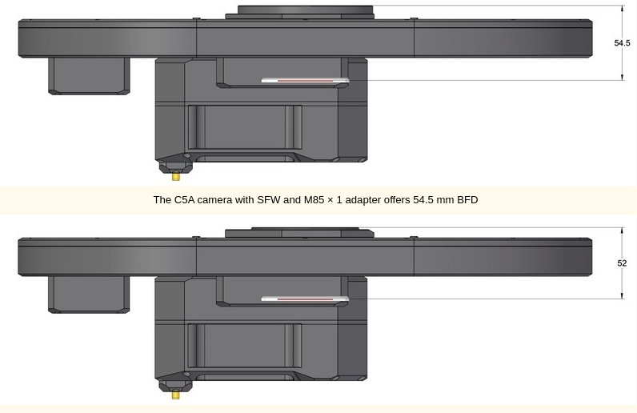
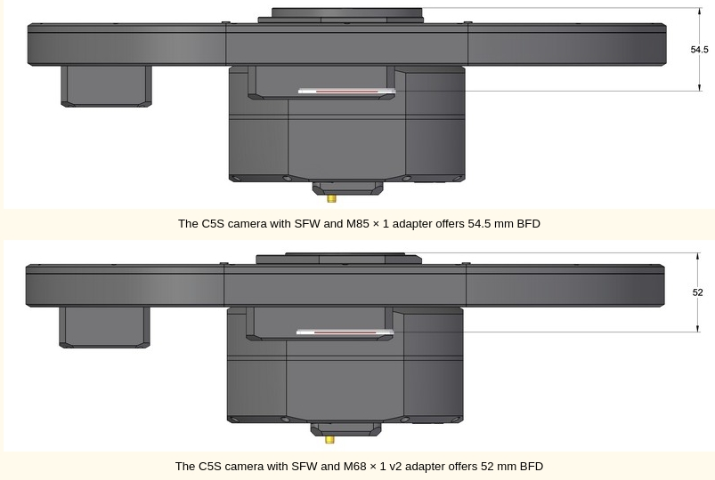
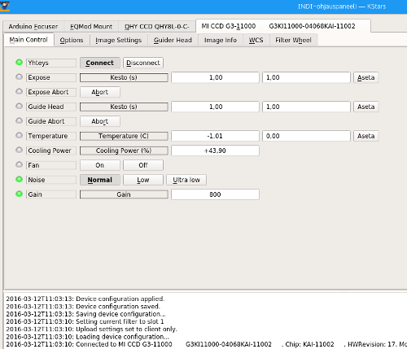

## Features

INDI Moravian driver supports all Moravian Instruments (MI) family of cameras & filter wheels.

**The new line of Standalone Filter Wheels:**

The ability to control an internal filter wheel (IFW) was a part of the Gx (and later Cx) camera design from the very beginning. Even the very first Moravian Camera, the G2-0400, could be ordered with internal filter wheel. When the internal filter wheel was not used, the camera front shell become thinner and the electronics and firmware, intended to control the wheel, remained unused. Hence come the idea to equip the camera with en external connector for the filter wheel, which could be attached to the camera front shell. A new line of external filter wheels (EFW) was born.

From the camera firmware or the user's controlling software point of view, there is little to no difference between the internal and external wheels. Because the same electronics and software controls both variants, it is not necessary to distinguish between them and all drivers work without any changes. Commands setting filters go through the camera in both cases and the camera itself also provides the power to the wheel.

The natural feature of the external filter wheels is the ability to accommodate more filters, as their diameter is greater compared to internal ones. Some cameras with particularly large sensors (the C4 and C5 series) even do not allow integration of the IFW at all — filters necessary for these cameras are so big that they the cannot be used inside the camera shell and the EFW is the only option. But even the external filter wheel diameter has construction limits, it is not possible to simply increase both EFW shell and filter wheel itself. The diameter and weight would be so big, that usage of such wheels would not be practical.

Natural solution of this problem is placing of two smaller filter wheels beside each other. The total number of filter positions is lower than the sum of positions in both wheels from obvious reasons: one position in each wheel must remain empty (clear) and it is set as an actual position when a filter from the other wheel is to be used not to interfere with it. So, if for instance two filter wheels with five positions each are used, we denote such wheel as 8+Clear positions. This means four positions in both wheels may be used for any filter, which makes 8 total filter positions. When both filter wheels are set to index 0 (the clear position), one additional clear position is added to the total number of filter positions.

**Remark:**  Distinguishing to which position each wheel should be rotated is handled by the SFW driver and from the user's perspective such wheel acts as one wheel with 9 position, filters are indexed from 0 to 8.

The first Moravian Instruments Standalone Filter Wheel (SFW) comes in the “XL” flavor, which indicates it is even greater than the larges “L” sized EFW available. Number of available positions depends on filter size:

-   8+Clear positions for 65 × 65 mm square filters, suitable for C5 cameras (both asymmetrical C5A and symmetrical C5S variants)
    
-   12+Clear positions for 50 × 50 mm square filters, suitable for C5-100M cameras (with some vignetting over the sensor short edge), but also for C4 and C3 cameras, also using 50 × 50 mm filters
    

The SFW filter wheels are equipped with 12 V DC 5.5/2.5 mm power plug as well as USB 1.1 data connection. Latest SIPS v4.1 and later software contains native driver for these wheels, as well as Moravian Camera Ethernet Adapter firmware, ASCOM drivers for windows, Linux libraries and INDI/INDIGO drivers are available etc. Also, the Moravian Camera SDK contains libraries, headers and API description allowing to control the SFW from other software packages as well as from Python etc.

While all EFWs from “XS” to “L” size are designed to preserve the very same BFD on all Cx cameras, the SFW naturally increased the BFD because of the design using two overlapping wheels. The resulting BFD depends on the adapter used.

The SFW control can be also handled by the Moravian Camera Ethernet Adapter together with a main imaging, guiding and context cameras. Only make sure the Moravian Camera Ethernet Adapter device is updated with the latest firmware available. The SDK for both Windows and Linux now include libraries allowing control of SFW from any other software, Python script etc. Also new ASCOM drivers are available for the SFW.

## Operation

Once you're connected, you can capture images as FITS from the camera, control temperature, and set image binning and frame subset. The driver will automatically upload these images to the client in FITS format. If your camera is equipped with a filter wheel, you can control the position of the wheels and designate a name to each filter.