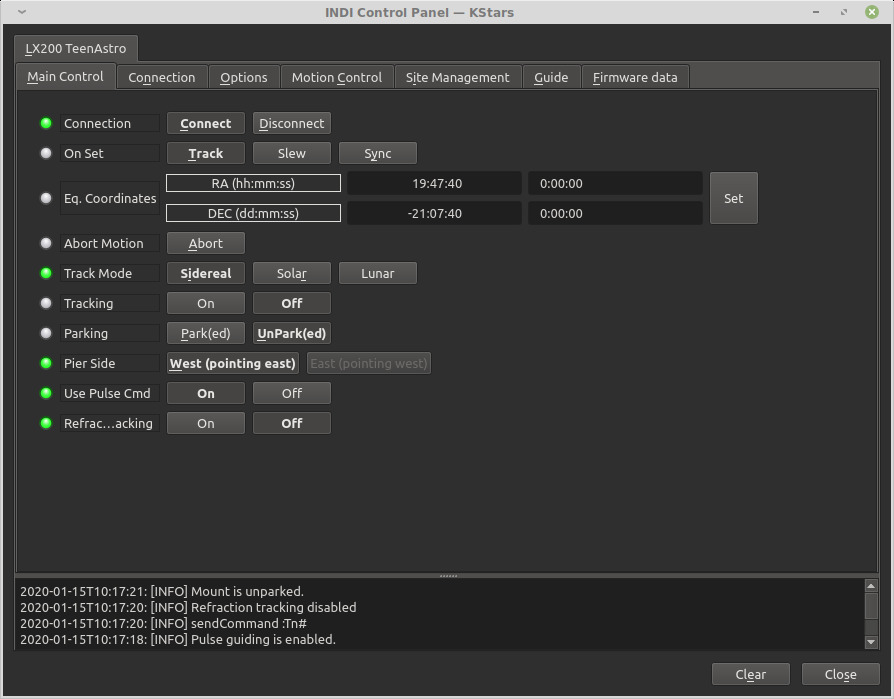
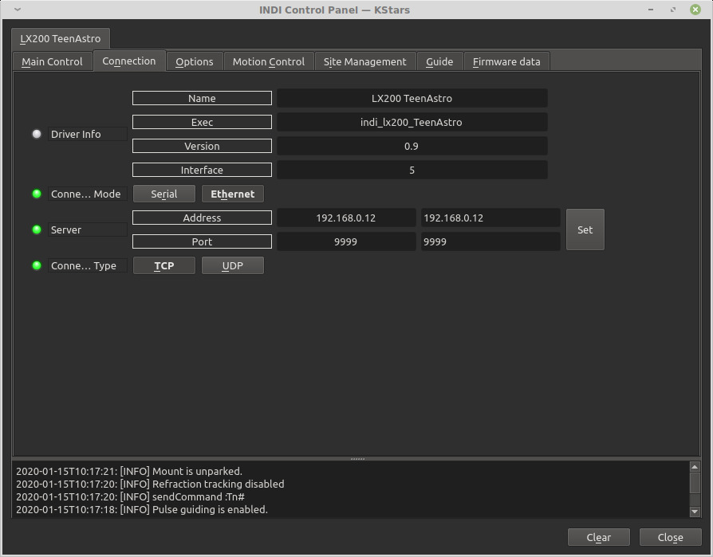
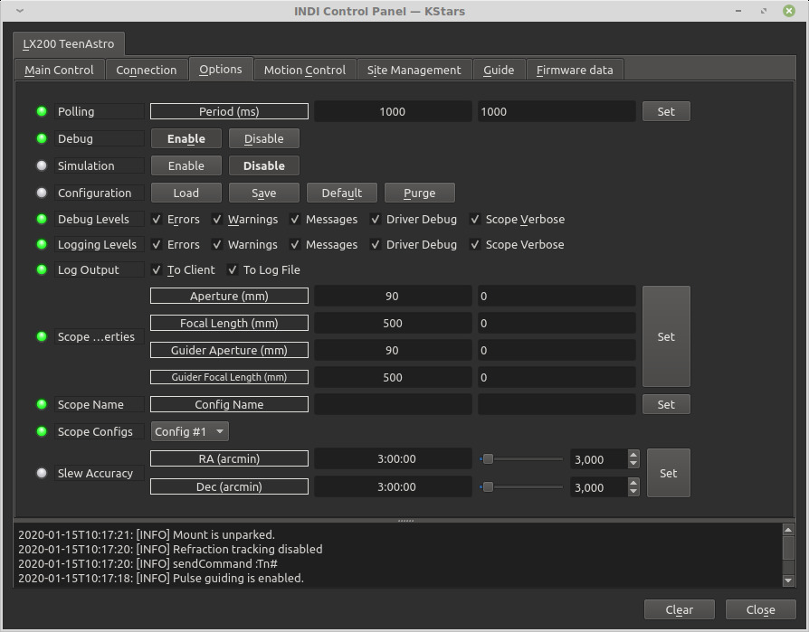
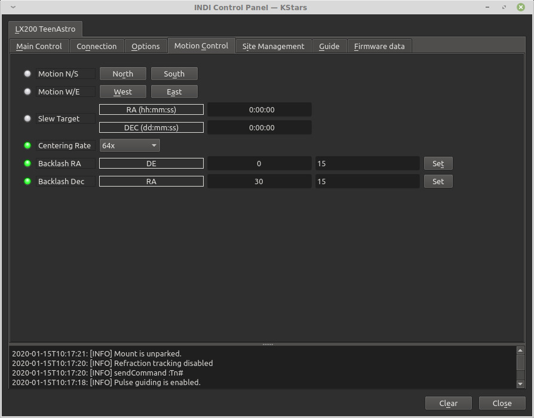

## Features

The INDI TeenAstro driver interacts with a mount controller using the LX200 protocol through a serial link.

The TeenAstro mount controller can be used with many different mounts that use stepper motors, including SkyWatcher, Astro-Physics and Takahashi.

Current features are:

-   GOTO, Sync
-   Slew Speeds: 0.5x, 1x, 2x, 4x, 16x, 32x, 64x, 0.5 Max, Max
-   Track Rates: Sideral, Lunar, Solar. Track Modes: Equatorial
-   Tracking can be disabled
-   Meridian Flip is not supported
-   One custom parking positions
-   Pulse-guiding is supported
-   Guide Rates: 0.25x, 0.5x, 1x
-   ST4 Guiding is supported

The driver has its own internal model and does not use the INDI Alignment subsystem to build a model for the sky.

It needs to be aligned before it can be used with the driver. The default home position is with the telescope pointing towards the pole

## Connectivity

### 1. USB

The controller connects via USB with a standard A-B cable.

### 2. Network

It supports networked connections over TCP/IP, through Wifi only (with a firmware version 1.1 or above)

The IP address is determined by the network (or self-assigned in case of stand-alone operation). The port number is 9999. To connect the mount, select the option "One To One" in the hand controller Wifi menu

### 3. Bluetooth

TeenAstro does not support Bluetooth.

### 4. First Time Connection

Before starting the driver, power the mount and make sure it is looking at the celestial pole with the weights down.

When running the driver for the first time, go to the  **Connection**  tab and select the port to connect to. You can also try connecting directly and the driver shall automatically scan the system for candidate ports. You can select  _Ethernet_  mode and enter the IP address and port for TeenAstro. After making changes in the Connections tab, go to  **Options**  tab and save the settings.

## Operation

### Main Control

The main control tab is where the primary control of TeenAstro takes place. To track an object, enter the equatorial of date (JNow) coordinates and press Set. The mount shall then slew to an object and once it arrives at the target location, it should engage tracking at the selected tracking rate which default to Sidereal tracking. Slew mode is different from track mode in that it does not engage tracking when slew is complete. To sync, the mount must be already tracking. First change mode to Sync, then enter the desired coordinates then press Set. Users will seldom use this interface directly since many clients (e.g. KStars) can slew and sync the mount directly from the sky map without having to enter any coordinates manually.

3 tracking modes are supported: Sidereal, Lunar, and Solar. Tracking can be engaged and disengaged by toggling the  **Tracking**  property.

### Options

Under the options tab, you can configure many parameters before and after you connect to the mount.

-   **Configuration**: Load or Save the driver settings to a file. Click default to restore default settings that were shipped with the driver.
-   **Simulation**: Enable to disable simulation mode for testing purposes.
-   **Debug**: Enable debug logging where verbose messaged can be logged either directly in the client or a file. If Debug is enabled, advanced properties are created to select how to direct debug output.  [Watch a video on how to submit logs](https://stellarmate.com/support/logs-submission.html).
-   #### Dome Parking Policy
    
    Dome is not supported at this time.
    
      
    
-   **Scope Properties**: Enter the Primary and Seconday scope information. Up to six different configurations for _Primary_ and Secondary _Guider_ telescopes can be saved separately, each with an optional unique label in  **Scope Name**  property.
-   **Scope Config**: Select the active scope configuration.
-   **Joystick**: Joystick is not supported.

### Motion Control

Under motion control, manual motion controls along with speed and guide controls are configured.

-   **Motion N/S/W/E**: Directional manual motion control. Press the button to start the movement and release the button to stop.
-   **Slew Rate**: Rate of manual motion control above where 1x equals one sidereal rate.
-   **Guide N/S/W/E**: Guiding pulses durations in milliseconds. This property is meant for guider application (e.g. PHD2) and not intended to be used directly.
-   **Guiding Rate**: Guiding Rate for RA & DE. 0.3 means the mount shall move at 30% of the sidereal rate when the pulse is active. The sideral rate is ~15.04 arcseconds per second. So at 0.3x, the mount shall move 0.3*15.04 = 4.5 arcsecond per second. When receiving a pulse for 1000ms, the total theoretical motion 4.5 arcseconds.
-   **Track Default**: Default tracking rate to be used on startup.
-   **ST4 N/S/W/E**: If the mount is receiving guiding pulses via ST4, apply this rate.

The  **Slew Rate**  dropdown is used to control the  **manual**  speeds when using the NSWE controls either directly or via a joystick. To set the  **GOTO**  speeds (when mount moves from one target to another via a GOTO command), you need to set it via the hand controller Mount Menu.

### Site Management

Time, Location, and Park settings are configured in the Site Management tab.

-   **UTC**: UTC time and offsets must be set for proper operation of the driver upon connection. The UTC offset is in hours. East is positive and west is negative.
-   **Location**: Latitude and Longitude must be set for proper operation of the driver upon connection. The longitude range is 0 to 360 degrees increasing eastward from Greenwich.
-   **Parking Position**: Upon connection to the mount, Ekos loads these values into the mount's motor controller to initialize the (stepper) motor step values. The default values represent the home position where the mount points to the celestial pole - i.e. 0 deg RA, 90 deg DEC.
-   **Parking**: To set the parking position of the mount to the home position, click “Default”, then "Write Data " - this saves the home values as the parking values. To set the parking position of the mount to a custom position, slew the mount to the desired position and click “Current”, then "Write Data " - this saves the current motor step values as the parking values.
    -   **IMPORTANT**: For the first time Ekos connects to the mount, or if for any reason the parking position has become incorrect. Make sure the mount is in the home position, power up the mount, connect Ekos and set the parking position to home by clicking “Default”, then "Write Data ".