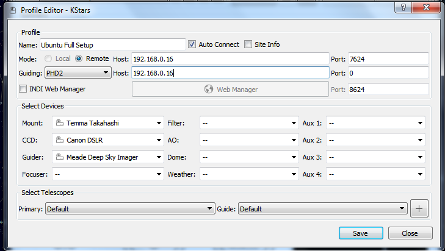
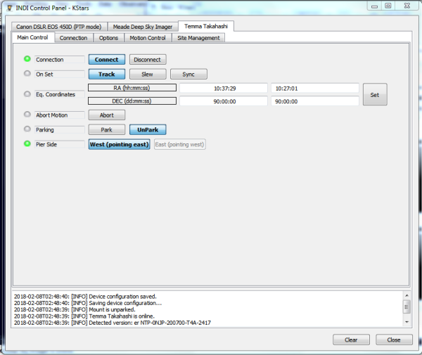

##   
Features

The driver supports Takahashi Temma mounts. Basic functions such as Track, Sync, and Park are supported. Select Temma Takahasi from your client. For example, if using Ekos, you can select the driver from telescope dropdown in the Profile Editor.

## Operation

Before establishing connection to the mount, make sure to select the appropiate serial port from the connections tab. You can either select from the available auto-detected ports (e.g. /dev/ttyUSB0) or enter a port manually.

By default, the mount assumes it is looking toward the celestial pole with the weights down. From this startup home position, you can slew the mount anywhere above the horizon. Depending on your client, you can either control the mount from your client's skymap or via the INDI control panel.

Since the mount is not aligned, GOTO is not expected to be accurate. To improve the mount accuracy, use an alignment program (e.g.  [Ekos Alignment](https://stellarmate.com/support/ekos/align.html)) or center the target star or object within the camera/eyepiece and then use  **Sync**  to synchronize the mount position. On the next GOTO, the mount should be more accurate. When slewing to an object on the other side of the meridian, it's recommended to double-check the position again and synchronize when necessary.

Parking position can be set to any arbitrary location above the right. It is managed from the  _Site Management_  tab or directly via the Skymap  **Set As Parking Position**  option.