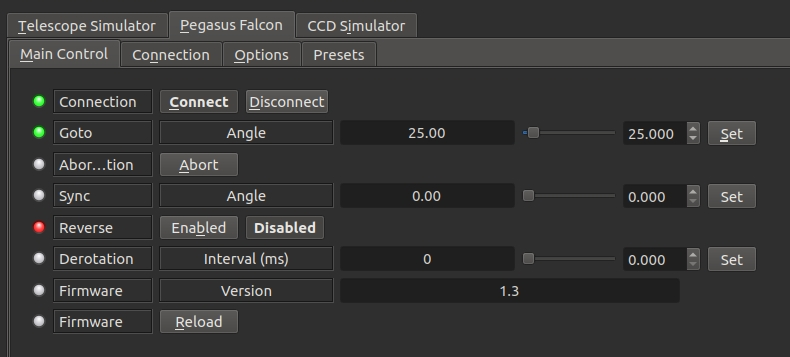
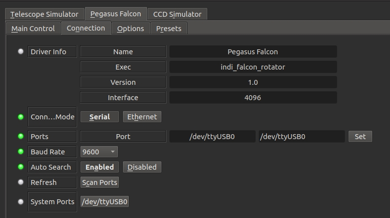
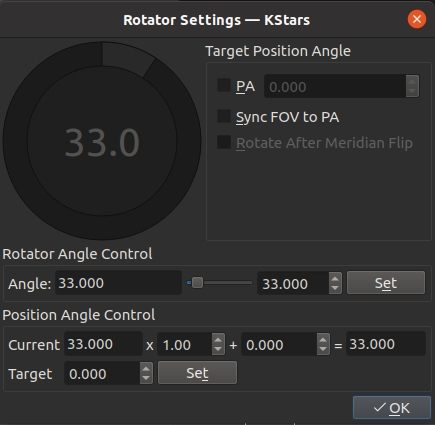

## Features

Pegasus Astro – Falcon Rotator is a light-weighted, low profile camera field rotator. Do not be fooled by its thin size! It can lift and handle heavy image trains – dead accurate! Very easy to operate via INDI and it will make your life easier to automatically adjust with precision your camera field.

### Main Control Tab

-   **Goto**: Command rotator to a specific rotation angle. 0 degrees is home position where the camera is level.
-   **Sync**: If the current position angle value is incorrect, use Sync to reset it to the correct observed value.
-   **Derotation**: Set  **Experimental**  field derotation. Value is steps per millisecond.
-   **Firmware**: Display rotator firmware.
-   **Reload**: Reload rotator firmware.

### Presets

You may set pre-defined presets for common focuser positions in the  _Presets_  tab.

-   Preset Positions: You may set up to 3 preset positions. When you make a change, the new values will be saved in the driver's configuration file and are loaded automatically in subsequent uses.
-   Preset GOTO: Click any preset to go to that position

## Operation

The INDI Pegasus Falcon driver provides complete functionality for all the features supported by Falcon rotator including GOTO, Sync, and field derotation.

Connection is via USB. Set the port accordingly or click  **Scan Ports**  to detect any ports on the system. The angle reported is the rotation angle and should not be confused with  [Position Angle](https://en.wikipedia.org/wiki/Position_angle)  (PA) reported by astrometry. Some clients (e.g. Ekos) provide rotator control. Once an image is plate solved via astrometry, the image PA is known and it is then possible to command the rotator to a specific position angle

