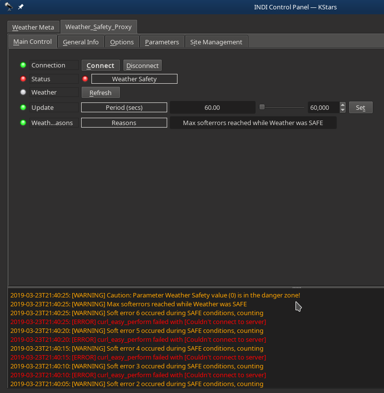
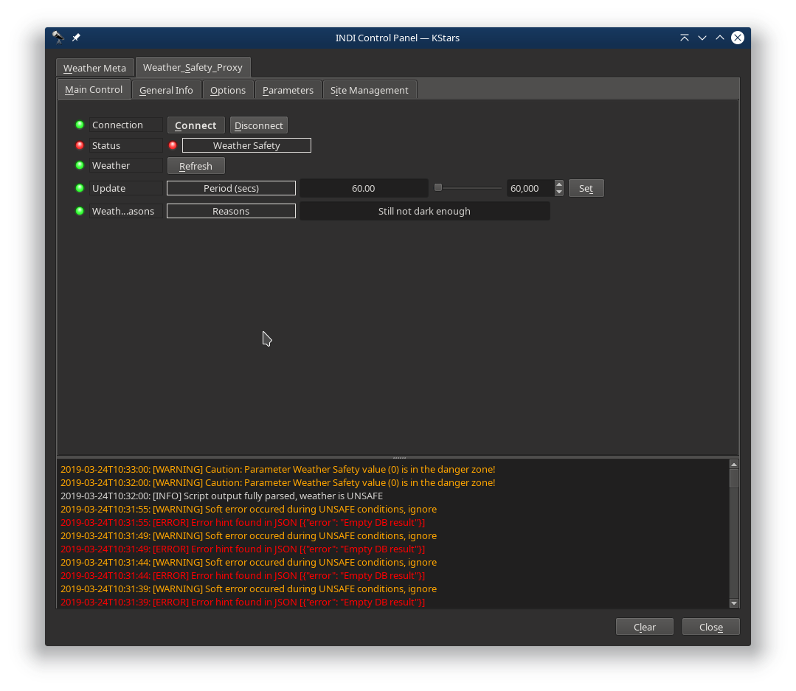
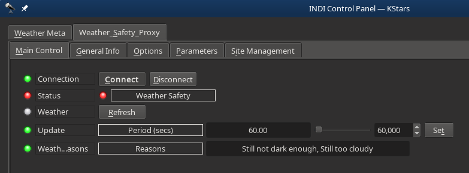
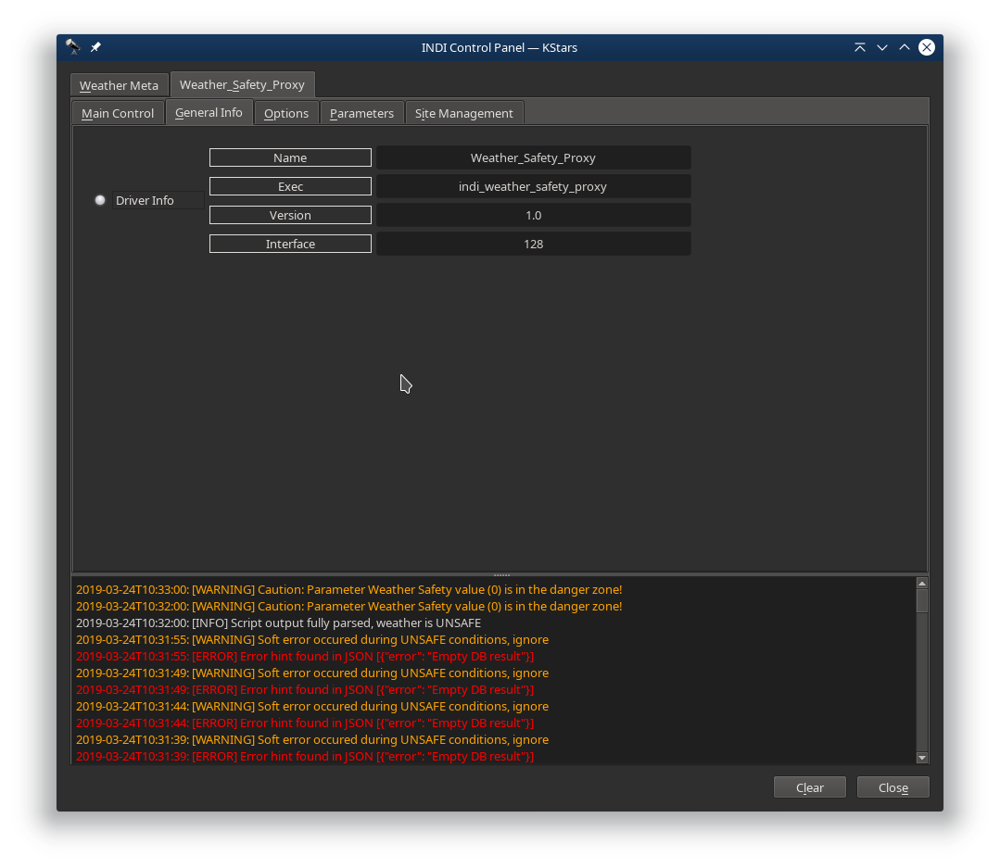
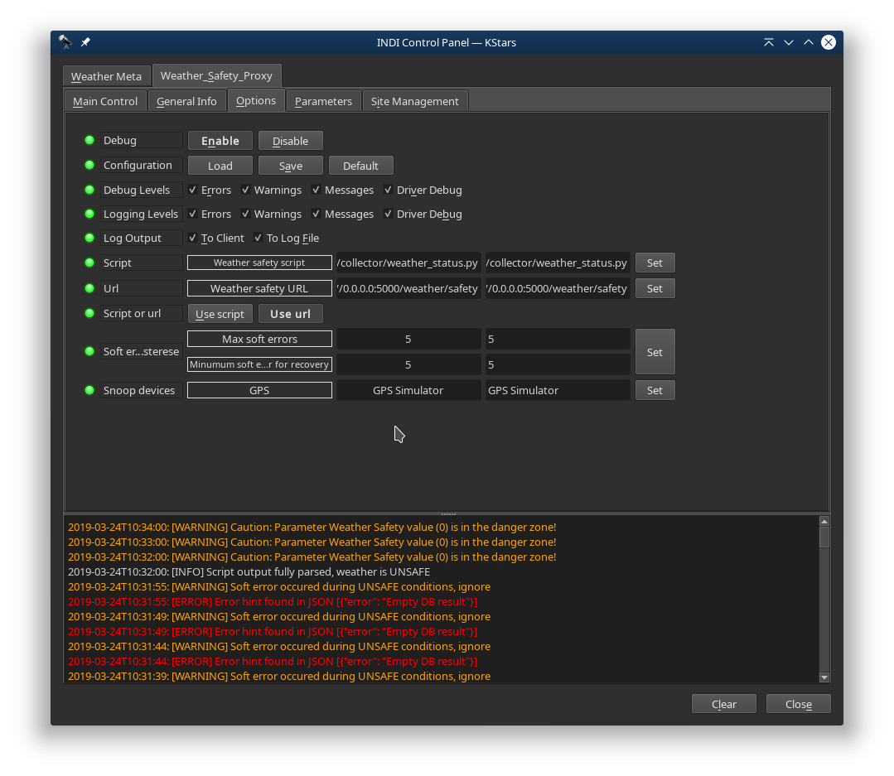
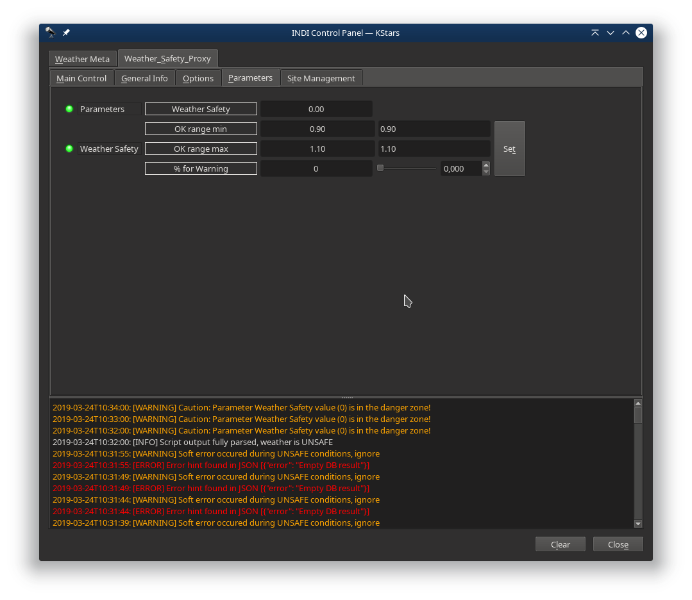

## Features

The Weather Safety Proxy (WSP) driver connects a Weather Safety Service (WSS) to INDI such that schedulers and observatory dome and roll-off-roof drivers can be told when it is safe to open and when they must close. The WSP driver differs from most other Weather Station drivers in that it does not deal with sensor readings itself, that is deferred to the WSS. The WSP driver proxies the safety state that the WSS determines and adds configurable hysteresis levels for soft errors when a safety reading update is missed so that the observatory does not immediately close down on a glitch. When on the other hand the WSS reads as UNSAFE the observatory is signalled to immediately close down. The WSS is expected to have hysteresis handling itself so to not cause the observatory to open/close too often.

Current features are:

-   Connect to Weather Safety Service via Script or URL
-   Configurable poll interval.
-   Configurable soft error hysteresis levels
-   Optional Safety Reasons text displayed as conveyed by the Weather Safety Service

## Setup

The Weather Safety Proxy polls a Weather Safety Service via either a local script or a curl URL call, configurable in the Options tab. The poll interval is configurable in the Main Control tab and defaults to 60 seconds.

The Weather Safety Service which the Weather Safety Proxy driver polls is expected to report its state in JSON format. Required fields are roof_status with open_ok integer (0 for UNSAFE and 1 for SAFE) and optionally a reasons text field. For instance :

{
    "timestamp_utc": "2019-03-24T23:26:02",
    "roof_status": {
        "open_ok": 0,
        "reasons": "Still not dry long enough"
    }
}

In case the Script itself determines a soft error it can report so in an error field like this :

{"error": "Empty DB result"}

This will be logged :

2019-03-24T11:50:08: [ERROR] Error hint found in JSON [{"error": "Empty DB result"}] 

In case of SAFE conditions soft errors will be logged and counted until they reach the hysteresis treshold.

2019-03-23T22:41:58: [ERROR] curl_easy_perform failed with [Couldn't connect to server] 
2019-03-23T22:41:53: [WARNING] Soft error 4 occured during SAFE conditions, counting 

In case of UNSAFE conditions soft errors are logged and otherwise ignored

2019-03-24T11:47:02: [WARNING] Soft error occured during UNSAFE conditions, ignore 

Additional fields in the JSON like the timestamp_utc field in the above JSON are ignored.

The Weather Safety Service is not included in this driver.

## Main Control tab

-   Connection switch is used to start and stop the driver.
-   The Status / Weather Safety light is red for UNSAFE and green for SAFE
-   Weather refresh can be used while debugging so you do not have to wait for the next poll interval
-   Update Weather Safety Service polling period in seconds. Defaults to 60 seconds.
-   Weather Safety Reasons show the optional Safety Status reasons, if any, as well as any Hysteresis state

## General Info tab

General Info tab just shows the driver's name and binary and version

## Options tab

The Options tab is used for initial setup and finetuning of the Hysteresis levels.

-   Debug can be enabled or disabled here. Note that in EKOS this must be done in EKOS Logs settings before connecting to INDI.
-   Configuration of all settings can be saved and loaded. On Linux this is in ~/.indi/Weather_Safety_Proxy_config.xml
-   Script is optional and the full path to an executable script that prints the Weather Safety Service status in JSON.
-   Url is optional and the full URL for curl to connect to a Weather Safety Service status that reports in JSON
-   Script or Url selects to use either the above Script or the Url
-   Soft error hysteresis levels. Max soft error level during SAFE state. If this level is reached the state becomes UNSAFE. A single poll lasts 5 seconds (hardcoded in indi_weather base class). Minimum soft error for recovery is intended to prevent flapping. This poll lasts the configured time each (which default 60 seconds).
-   The GPS snoop device is inherited from base class and not used.

## Parameters tab

The Weather Safety Proxy cannot set the needed WEATHER_STATUS state directly. Instead it sets a WEATHER_SAFETY 'sensor' to 0 for UNSAFE and 1 for SAFE and specifies a range for SAFE from 0.9 to 1.1

-   Parameters / Weather Safety just shows the current state. 0 for UNSAFE and 1 for SAFE.
-   Weather Safety / OK range min and OK range max are chosen just below and above 1.0 to have 1.0 being the OK value for Weather SAFE state. They default to 0.9 and 1.1.
-   Weather Safety / % for warning defaults to 0 as the Weather Safety Service is expected to be absolute and only report 0 and 1 so there is no need for the INDI weather subsystem to have a warning margin on it.

## Site Management tab

Site Management is not used. This tab is inherited from general Weather devices snooping on GPS.